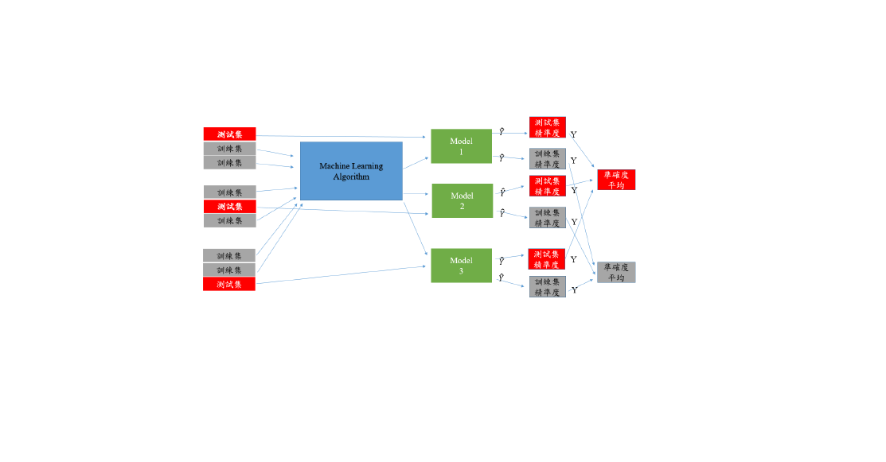
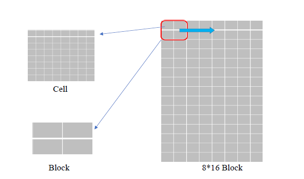
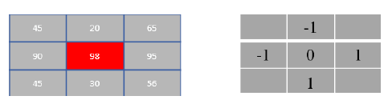
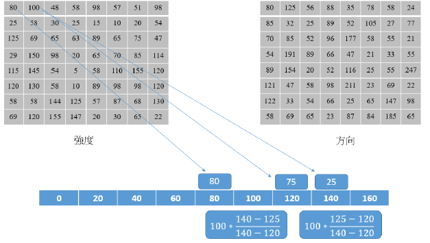
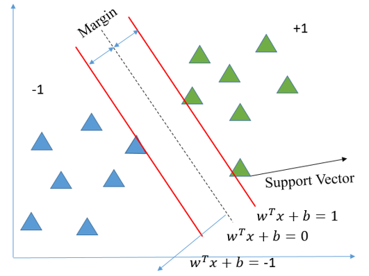
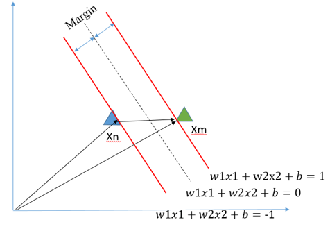
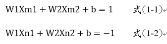
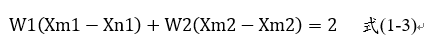
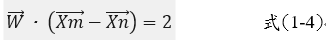

### 交叉驗證

+ 交叉驗證最主要是要預防模型發生過擬合現象，所以在模型訓練時需要將資料分成訓練集和測試集

+ 在 K-Fold 的方法中我們會將資料切分為 K 等份，K 是由我們自由調控的，以圖為例：假設我們設定 K=3，也就是將訓練集切割為3等份。這意味著相同的模型要訓練3次，每一次的訓練都會從這3等份挑選其中2等份作為訓練資料，剩下1等份未參與訓練並作為驗證集。因此訓練3回將會有3個不同驗證集的 Error，這個 Error 通常我們會稱作 loss 也就是模型評估方式

### HOG特徵 (Histogram of Oriented Gradient)

+ HOG特徵是一種圖像局部特徵，對圖像局部梯度幅值和方向做投票，形成梯度特性直方圖 ，最後將局部特徵總合起來

+ HOG特徵計算步驟如下

    ### 圖像預處理

    + 樣本值可以是任意大小，但是唯一限制是需要有固定的寬和高，例如寬與高為1:2

    ### 計算梯度以及方向

    + 以一個64 * 128的圖片來說，需要先將其劃分成 8 * 8 Cell，計算Cell內梯度以及方向並將其轉換成 2 * 2 Block

    

    ### 接下來在cell內做方向以及梯度強度，以下範例

    

    + 𝐺𝑥 (𝑥, 𝑦) = 𝐻(𝑥 + 1, 𝑦) − 𝐻(𝑥 − 1, 𝑦)  式(1-1)

        + 95-90=5

    + 𝐺𝑦 (𝑥, 𝑦) = 𝐻(𝑥, 𝑦 + 1) − 𝐻(𝑥, 𝑦 − 1) 式(1-2)

        + 30-20=10 

    + 𝐺(𝑥, 𝑦) = √𝐺𝑥(𝑥,𝑦)2+𝐺𝑦(𝑥,𝑦)2          式(1-3)

        + √(5*5)+(10*10)

    + 𝐺𝜃 (𝑥, 𝑦)=𝑡𝑎𝑛−1𝐺𝑦(𝑥,𝑦)𝐺𝑥(𝑥,𝑦)         式(1-4)

        + 𝑡𝑎𝑛−1(10/5)

    + 梯度直方圖是在一個8 * 8的cell裡面計算的。那麼在8 * 8的cell裡面就會有8 * 8 * 2 = 128個值，2是包括了梯度強度和梯度方向。通過統計形成梯度直方圖，128個值將會變成9個值，大大降低了計算量，同時又對光照等環境
    變化更加地robust。

    

    + 計算完後以直方圖型式將每個Cell轉換成 9 * 1 Block，接下來以 9*4 Block做向量歸一化，做向量歸一化是為了平均整體圖像的光照

    + V=[b1,b2,b3,b4,…….,b36] 式 (1-5)

    + K=√𝑏1*b1+√𝑏2*b2+√𝑏3*b3+√𝑏4*b4+⋯+√𝑏36*b36 式 (1-6)

    + Vector=[𝑏1/𝑘,𝑏2/𝑘,𝑏3/𝑘,𝑏4/𝑘…,𝑏36/𝑘] 式 (1-7)
    
    ### 最後一個步驟計算向量特徵化

    + 將所有 Block串接起來，每次 Block會右移動一格，總共移動了 7格，向下移動一格總共移動 15格 ，所以總共有 105塊 Block，每個 Block內又有 36個 Vector，所以總
    Total = 105*36=3780個特徵

### SVM介紹

+ SVM是一種統計學習的監督式演算法，可以用於分類和迴歸問題，那在SVM中需要尋找一條超平面(Hyperplane)來將問題做切割，分割出來的最大邊界稱作Margin，靠近正負樣本的值稱為Support Vector

    ### Hard Margin SVM

    + 定義:不希望SVM中出現任何錯誤分類，並且最大化Hyperplane與兩條紅線之間距離

    

    + 首先先將不必要的點移除，留下Support Vector

    

    + 為了算出Xm到Xn距離因此得出式(1-1)和式(1-2)

    

    + 利用式(1-1)減去式(1-2)得出距離為式(1-3)

    

    + 化簡過後變成式(1-4)

    

    

    
